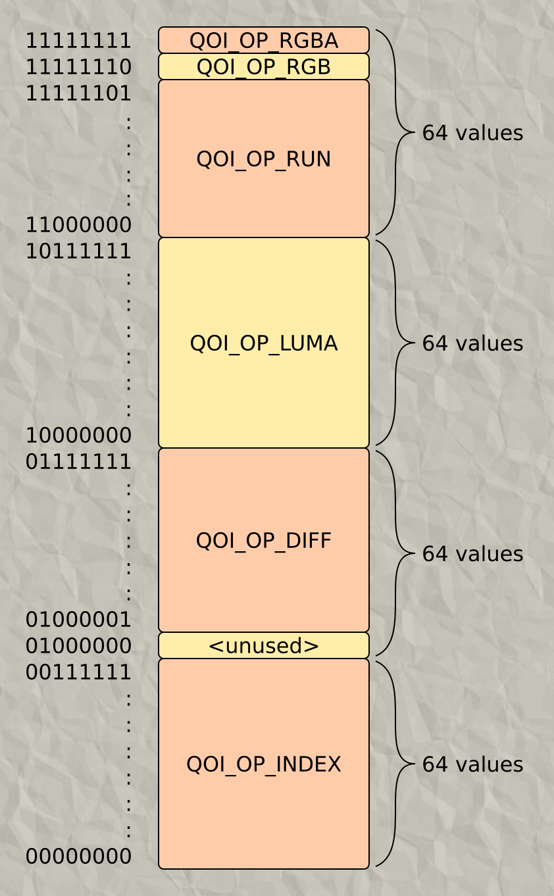
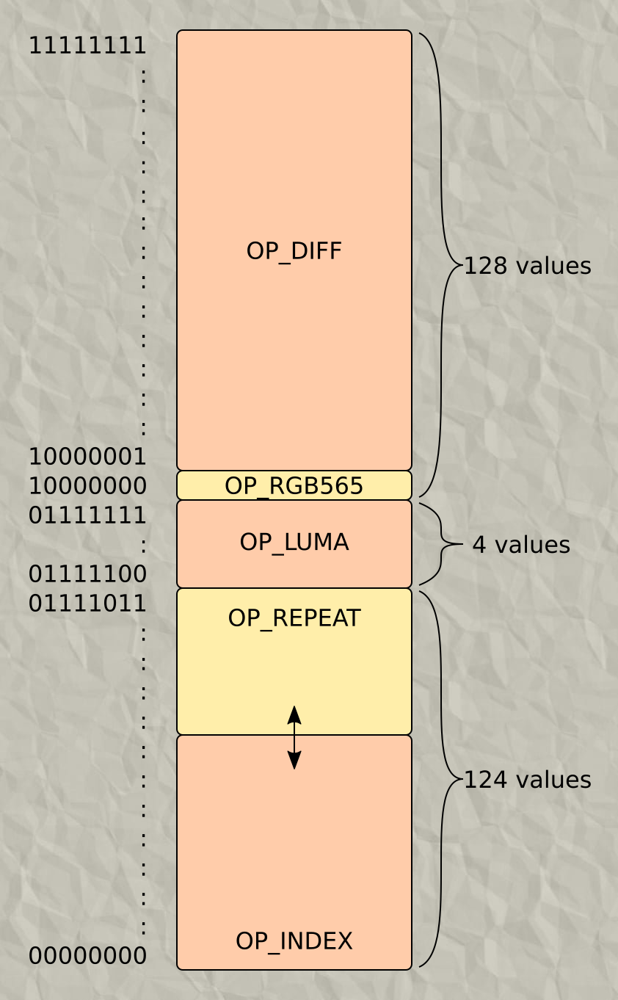
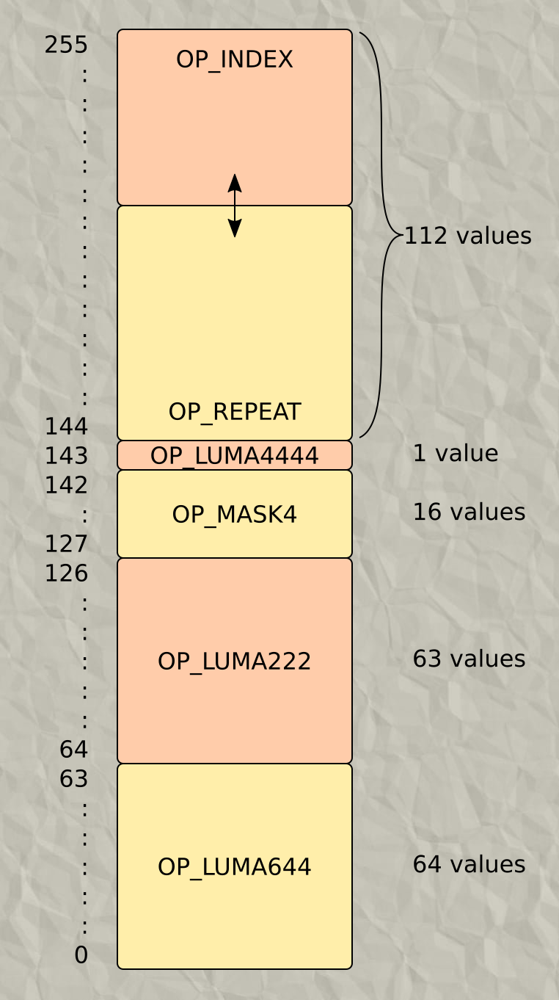

# FluidQOI &mdash; A parametric version of [QOI](https://github.com/phoboslab/qoi)

This is a proof-of-concept building upon an idea, which I called **LiquidQOI**,
to create an evern more powerful algorithm called **FluidQOI**.

In QOI, OP codes have fixed bit patterns, like `0b11xxxxxx` for OP_RUN,
and then special instructions to allow another OP codes to overlap
them, like `0b1111111x` (OP_RGB and OP_RGBA).

The concept of **FluidQOI** is to look at how many values each *fixed size*
OP code requires, cram this into the available space in any order,
and fill the remaining space (which should be contiguous) with the
only two (for now) variable-length OPs, OP_INDEX and OP_RUN.
This is explained in more detail under the heading **FluidQOI**.

## Original QOI
The code map of QOI looks like this:



Because it can be grouped in four blocks of 64 values, aligned at
multiples of 64, this lends itself nicely to using bit masks.
Bit masks are nice for a concise and easily understood _human readable_
specification document, but not necessarily the best choice.

## LiquidQOI

While experimenting with other color depths (in my particular
case, RGB565), I was in a situation where I had 124 values
left to fill with the variable-length OP codes.
I could choose 64 OP_INDEX values (aligned at the bottom) and
60 OP_RUN values, or swapped.

Then I had a new idea.
Why not freely vary the balance between the two with a parameter,
and see what works best for a particular set of images?



With that system in place I got some promising results.
But why stop there?
Restricting oneself to bitmasks is an arbitrary choice,
and my next step was replacing bitmasks checks and bit
masks with `>=` checks and subtractions respectively.
Computationally there's no benefit to using bitmasks over doing arithmetic.

Enter FluidQOI.

## FluidQOI

In this iteration, the blocks of OP values can
be placed anywhere in the available space.
The caveat is that to efficiently decode the OPs,
you have to go from large to small*, _i.e_.:

```
assert code >= 0 && code < 256;
     if (code >= 129) { decode OP_DIFF; }
else if (code >= 128) { decode OP_RGB565; }
else if (code >= 124) { decode OP_LUMA; }
else if ...
```

(*small to large turns out to be a lot less _readable_, but probably just 
as efficient)

In order to retrieve the encoded information in the OP value,
instead of masking bits with a bitmask, we instead subtract:

```
     if (code >= 129) { decodeOpDiff(code - 129); }
else if (code >= 128) { decodeOpRGB565(/* There's no data in this value */); }
else if (code >= 124) { decodeOpLuma(code - 124); }
else if ...
```

It seems that a downside of this is that you can't efficiently check for an
arbitrary OP like you can with bitmasks, but that point is moot.
In QOI, this was already not possible, and in LiquidQOI, you can
arrange the OP codes in the value space in any order desired.
The logical choice of this ordering is the frequency with
which each OP code is encountered while decoding.
Finally, the space allocated for the _variable_ OP
codes is split in the same way as in LiquidQOI.  
(TODO: Allow the variable OP codes to be placed
independently instead of lumped together)

The name 'fluid' stems from the fact that there are also non-liquid fluids
(for example, gases), so fluid symbolically captures a larger scope.

This is the final code map for FluidQOI:



## Other changes

Unrelated to the the techniques described above, I made additional
changes that increased the average compression ratio, which
may or may not decrease the encoding or decoding speed:

- [Recursive (Bijective) repeat lengths](https://github.com/phoboslab/qoi/issues/191#issuecomment-1130405488)
- [Replacing hash function with history list](https://github.com/nigeltao/qoi2-bikeshed/issues/39),
- Replacing RGB opcode with the old MASK opcode,
- Replacing DIFF variants with LUMA variants (still experimenting with
  this),
- Adding LUMA variant that includes alpha,
- Encoder statistics of not many OP codes are used, how many of the values
  (first bytes of the OP codes) are used, and how many of the deltas occur.
  All of this helps decide the order of the OP
  codes and which DELTA/LUMA variants to employ.

Here are some preliminary results:


## Class diagram

